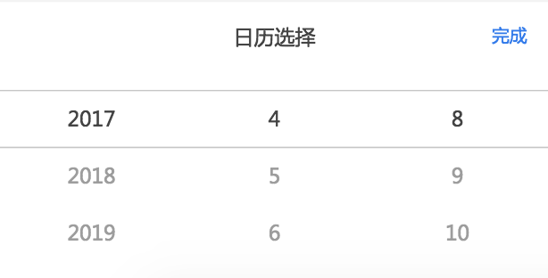
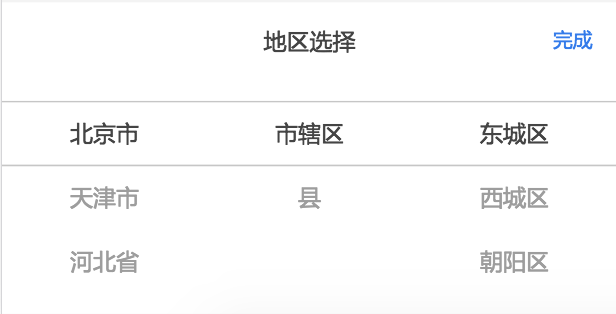
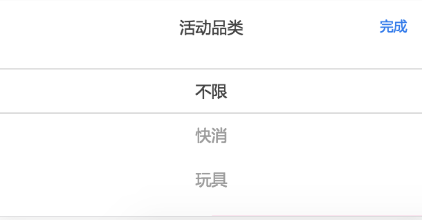

文件目录 

  

​          timers: 日期控件下处理 30， 31，闰年，平年

​          animation：动画处理效果（暂时只支持线性移动）

​          util: 处理滑屏事件（touchstart， move， end）

​          city: 省市区信息

​          AreaSelection: 地区选择组件主体

​          Datepicker: 日期选择组件主体

​     

组件调用方式 

​    vue：｛

​    

​      日期选择：

​        ｛
              minday:最小日期（可填）
              maxDay:最大日期（可填）
              HandleDatepicker: 日期选择后的回调函数（必填）
​              <Datepicker :minDay= 2016-01-01 :maxDay=2018-01-01" v-on:HandleDatepicker=HandleDatepicker/>

​              ​             

​              

​          ｝

​          

​      地区选择：

​        ｛

    			HandleDatepicker: 日期选择后的回调函数（必填）

​              <AreaSelection  v-on:HandleDatepicker=HandleDatepicker"/>


​              

​              

​          ｝

​      ComboBox：
    value:下拉框列表
    title：下拉框名称
    comPos：当前选中项
    comChange：完成回调
    hidden：显示与关闭
​	 <ComboBox 

​			 :value="comList" 

​      			 :title="comItem"

​      			 :comPos="comPos" 

​      			 v-on:HandleClick="comChange" 

​      			 :hidden="hidden" />

​	

​    ｝

    

```
 注：组件css基于750宽度，计算rem; 基于es6编写，需babel
 
 修复方法：内容不需在组件内填充，可在自己组件中定义填充内容及样式，通过事件拉起当前组件，
 在ComboBox组件下，多个select，通过事件调用单个组件视图
 例：
 <section class="values" v-text="activeTypeValue" @click="HandleComboShow()"></section>
 
 HandleComboShow() {
    this.hidden = false
    this.comPos = this.comPos1
    this.comList = this.screenList1
    this.comChange = this.HandleChange1
    this.comItem = '适用范围'
 }
```

​	 